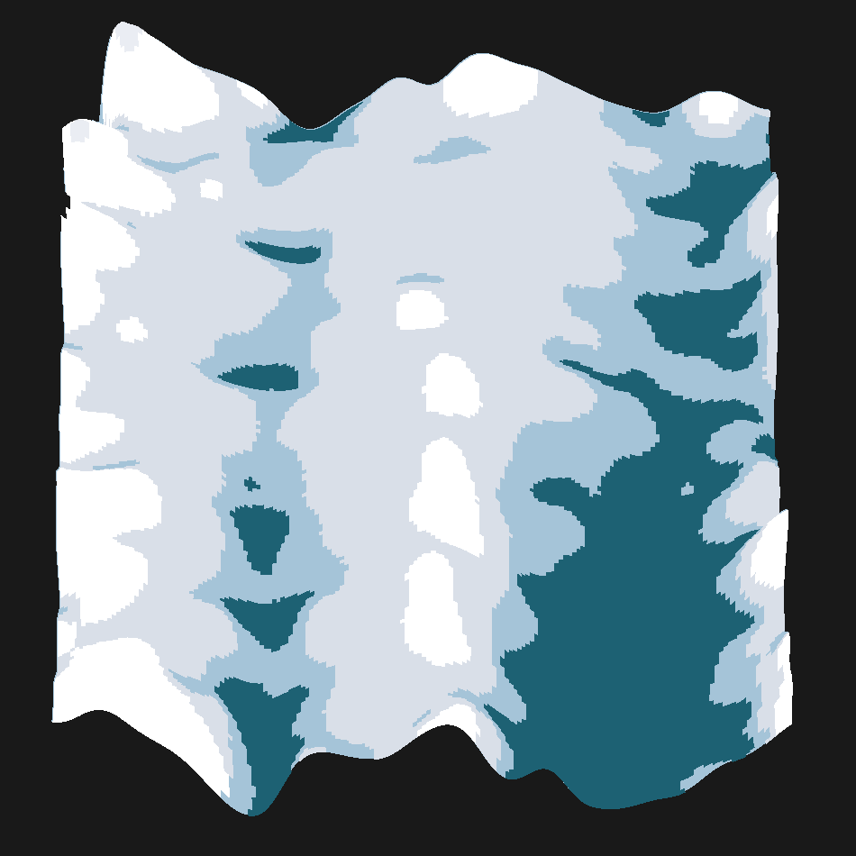

SparSCit documentation
=======================

SparSCit is a Python library for processing, analyzing, and visualizing
single-cell histone modification sequencing data (such as NanoC&T, scCUT&Tag,
scChIP-seq). It provides a complete pipeline from raw fragment loading through
embedding, clustering, landscape visualization, and statistical testing — all
built on top of AnnData.

Installation
------------

Install from PyPI::

   pip install sparscit

Or install in development mode::

   pip install -e .

Quick Start
-----------

.. code-block:: python

   import sparscit as sc

   # Configure global settings
   sc.set_defaults(n_jobs=-1, figsize=(10, 5))

   # Load data
   adata = sc.ld.fragments("fragments.tsv.gz", genome="hg38")

   # Filter cells and features
   sc.tl.filter(adata, layers=["counts"], min_obs_counts=[100])

   # Create layer configurations
   lc = sc.tl.make_layer_config(adata, layer="counts",
       normalize_with_obs_counts=True, log_transform=True)

   # Compute embeddings
   sc.em.pca(adata, lc)
   sc.em.spectral(adata, lc, n_components=30)

   # Build neighbor graph and cluster
   sc.gr.knn(adata, embedding_key="X_spectral")
   sc.gr.leiden(adata)

   # Visualize
   sc.pl.embedding2d(adata, "X_umap", color="leiden")

Module Overview
---------------

+------------------------+----------+---------------------------------------------------+
| Submodule              | Alias    | Purpose                                           |
+========================+==========+===================================================+
| ``sparscit.load``      | ``sc.ld``| Data loading (fragments, references, GO terms)   |
+------------------------+----------+---------------------------------------------------+
| ``sparscit.tools``     | ``sc.tl``| Core analysis tools (filtering, statistics, etc.) |
+------------------------+----------+---------------------------------------------------+
| ``sparscit.graph``     | ``sc.gr``| Graph construction, clustering, label transfer    |
+------------------------+----------+---------------------------------------------------+
| ``sparscit.embedding`` | ``sc.em``| Dimensionality reduction and embeddings           |
+------------------------+----------+---------------------------------------------------+
| ``sparscit.plotting``  | ``sc.pl``| Visualization (embeddings, heatmaps, statistics)  |
+------------------------+----------+---------------------------------------------------+
| ``sparscit.advanced``  | ``sc.adv``| Advanced analysis (landscapes, HMMs, dynamics) |
+------------------------+----------+---------------------------------------------------+

Data Model
----------

SparSCit operates on ``anndata.AnnData`` objects. Data is stored in:

- **.X** — Main data matrix (cells × features)
- **.layers** — Additional data layers (e.g., different count matrices)
- **.obs** — Cell-level metadata (e.g., cluster assignments, pseudotime)
- **.var** — Feature-level metadata (e.g., gene names, genomic coordinates)
- **.obsm** — Multi-dimensional annotations (e.g., embeddings)
- **.obsp** — Pairwise annotations (e.g., distance/connectivity matrices)
- **.uns** — Unstructured annotations (e.g., community trees, GO results)

.. toctree::
   :maxdepth: 2
   :caption: Contents:

   tutorial
   modules